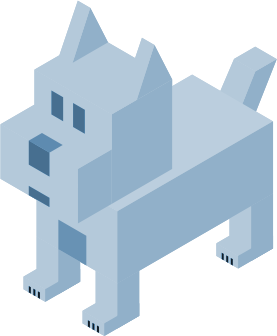

# **BARK**

> A lightweight documentation hub for all of IT's fomalized knowledge

<a href="https://github.com/BryanSeelyPointB/BARK/" target="_blank">Edit or Add Docs</a>
<a href="#/README.md">Get Started</a>

<!-- background color -->
